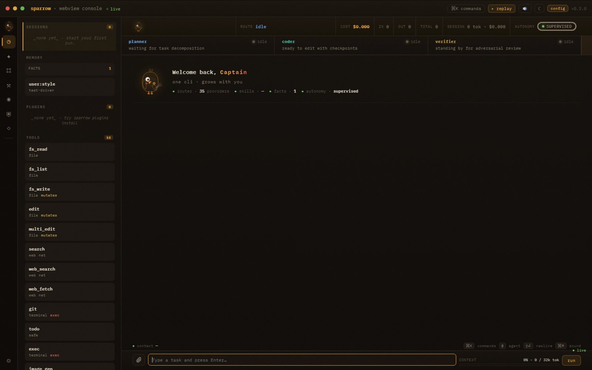

<div align="center">

# 🐦 Sparrow

**A local-first Rust agent cockpit — route, run, replay, rewind.**

[](https://github.com/ucav/Sparrow/actions/workflows/ci.yml)
[](https://github.com/ucav/Sparrow/actions/workflows/audit.yml)
[](https://github.com/ucav/Sparrow/releases)
[](LICENSE)
[](https://rust-lang.org)
[](https://crates.io/crates/sparrow-cli)
[](https://docs.rs/sparrow-cli)
[](https://github.com/ucav/Sparrow/releases/latest)
[](https://github.com/ucav/Sparrow/releases/latest)
[](https://github.com/ucav/Sparrow/releases/latest)
[](https://crates.io/crates/sparrow-cli)
[](https://github.com/ucav/Sparrow/stargazers)


*One event stream. Terminal UI, WebView cockpit, JSON output, or gateway — your choice.*

[](https://ucav.github.io/Sparrow/demo.html)


[Quick Start](#quick-start) · [Why Sparrow](#why-sparrow-vs-claude-code--codex--aider) · [Commands](#common-commands) · [Architecture](#architecture) · [Docs](#docs) · [Releases](https://github.com/ucav/Sparrow/releases)

</div>

---

Sparrow is a single-binary CLI agent written in Rust. It routes each task to the **cheapest capable model**, keeps you in control with **Git-backed checkpoints**, and makes every run **replayable**. Local models (Ollama) are always the first hop; cloud providers are explicit fallbacks.

The project focuses on a narrow product promise: a Rust-native local cockpit where every run is **visible, replayable, budgeted, and checkpointed**.

---

## Qu'est-ce que tu veux faire ? · What do you want to do?

> N'importe qui peut utiliser Sparrow. Décris ton problème avec tes mots —
> Sparrow le règle, te montre, et garantit que rien n'est jamais perdu.

```sh
sparrow bonjour                 # accueil : Sparrow regarde ton dossier et propose
sparrow fix "mon site plante"   # décris le problème → diagnostic + correction
sparrow explique src/app.js     # comprends un fichier ou une erreur, en clair
sparrow idees                   # tout ce que tu peux faire, par profil
sparrow whatis token            # c'est quoi ce mot ? (définition instantanée)
sparrow annule                  # reviens en arrière — rien n'est jamais perdu
```

Sparrow te parle en **langage simple par défaut** (`sparrow mode simple|pro`).
Pour le détail technique complet, tout le mode pro est là — rien n'est retiré.

---

## Why Sparrow vs Claude Code / Codex / Aider

| Capability | Claude Code | OpenAI Codex CLI | Aider | **Sparrow** |
|---|:---:|:---:|:---:|:---:|
| Single static binary, no Node/Python runtime | ❌ | ❌ | ❌ | ✅ |
| Choose any provider, any model | ❌ Anthropic | ❌ OpenAI | ✅ | ✅ **30+ registry** ¹ |
| Local-first (Ollama OOTB) | ❌ | ❌ | ⚠️ | ✅ |
| Git checkpoints + `rewind` per run | ❌ | ❌ | ⚠️ | ✅ |
| Budget caps (`--max-cost-usd` / `--max-wall-secs`) | ❌ | ❌ | ❌ | ✅ |
| WebView cockpit + TUI + JSON stream | ⚠️ TUI only | ⚠️ TUI only | ⚠️ TUI only | ✅ all three |
| Right-side tools panel (Preview/Diff/Terminal/Files/Tasks/Plan) | ⚠️ | ❌ | ❌ | ✅ event-driven |
| Live app preview embed (port auto-detect) | ❌ | ❌ | ❌ | ✅ |
| MCP server **host + client** | ✅ | ⚠️ | ❌ | ✅ |
| Drop-in import (`~/.claude/`, Codex, OpenCode) | n/a | ❌ | ❌ | ✅ |
| Multi-agent swarm (Planner → Coder → Verifier) | ❌ | ❌ | ❌ | ✅ |
| Telegram / Discord / Slack gateways | ❌ | ❌ | ❌ | 🔶 alpha ² |
| Pre-commit secret scanner bundled | ❌ | ❌ | ❌ | ✅ |
| Voice (`speak`, `transcribe`) | ❌ | ❌ | ❌ | 🔶 alpha ² |
| Replay & share session as URL/Gist | ❌ | ❌ | ❌ | ✅ replay · 🔶 share ² |
| Source open, MIT | ⚠️ closed | ⚠️ closed | ✅ | ✅ |
| Zero telemetry by default | ⚠️ | ⚠️ | ✅ | ✅ |

> ¹ Static registry of ~34 keyed providers; **Ollama and NVIDIA are the routes verified end-to-end** today — others depend on your credentials and provider availability. See the [status table](#status).
> ² ✅ = implemented and tested at the kernel level. 🔶 alpha = code is present and exercised by unit tests, but **not yet end-to-end validated** with live accounts. Labels are kept honest against the [status table](#status), not marketing.

See [`docs/comparison/vs-competitors.md`](docs/comparison/vs-competitors.md) for the long form (incl. OpenCode, Hermes, Continue, Cursor). This table reflects capabilities that exist in Sparrow today — it is a feature comparison, not a claim that Sparrow is universally "better" than mature tools.

---

## ✨ What's New — v0.10 « The Reasoner »

> **Inference-time scaling meets natural language.** Sparrow now understands plain speech (`sparrow do "fix my site"`), scales reasoning at inference time (best-of-N + Reflexion), and verifies with ground truth (build/test > LLM opinion). New agent framework with 10+ pluggable modules.

**🧠 Reasoning Engine**
- `sparrow reason` — live inference-time scaling: best-of-N, Reflexion loops, reason_max
- Full Reasoning-Max integrated into default soul — 27B models now think like frontier models
- Fable-Grade reasoning framework: 10+ pluggable agent modules (coding, safety, memory, self-correction…)

**🗣️ Natural Language (no command word needed)**
- `sparrow do "fix the login bug"` — describe what you want, Sparrow routes it
- Bare-text front door — just type naturally, no prefix needed

**🦾 Ground-Truth Swarm Verifier**
- Build/test results now outrank LLM opinion — objective verification over vibes
- Swarm pipeline: parallel agents → ground-truth gate → merge

**⚡ Performance**
- Boot ~30% faster: skip model-discovery for read-only commands
- Streaming micro-opt: move tokens instead of cloning

**🖥️ UI**
- Clickable file/artifact links → right-side viewer in WebView cockpit
- WebView/TUI overhaul in progress (typography, mobile, tablet)

**🛡️ Security**
- Landlock sandbox design for Linux
- First-run autonomy consent notice

**Install & distribution**
- **`cargo install sparrow-cli` v0.10.0** on crates.io
- **Pre-built binaries** for Linux, macOS, Windows on every release

**What was already here (v0.5.x)**
- Agentic engine with planner → coder → verifier pipeline, swarm orchestrator, git checkpoints + rewind.
- CLI rich rendering (syntect), streaming + chat composer, TTS/STT, voice commands.
- Memory CLI + FTS5 session search, encrypted credential store, pre-commit secret scanner.
- Humanized French errors, VS Code extension, Claude Code drop-in compat.

---

## Why Explore It

| | |
|---|---|
| **Model routing** | Budget-aware fallback chains across Ollama, NVIDIA, Anthropic, OpenAI-compatible APIs, and 30+ registry entries |
| **WebView cockpit** | Live route/token/cost/context at `http://127.0.0.1:9339/` with drawer panels, premium Timeline/Costs/Roadmap/Releases/Runs panels, slash palette, and agent picker |
| **Terminal-native** | Animated TUI cockpit, `sparrow run`, `sparrow chat`, `--json` output, replay, memory, gateway |
| **Rollback safety** | Auto-checkpoint before any mutating action; `sparrow rewind <id>` to restore |
| **Persistent context** | SQLite facts + knowledge graph, SOUL-style `.agent.md` files, guarded skill registry, full transcripts |
| **Browser/computer-use** | Playwright-backed browser tool and gated screenshot/click/type computer primitive |
| **Gateway** | Telegram, Discord, Slack, WebSocket API — wired with honest errors, not silent failures |
| **Release intel** | Opt-in public release scanner (`sparrow intel scan`) with local digests/backlog and no network when disabled |

<br>
<p align="center">
  
  <br><em>Sparrow WebView cockpit — Captain theme</em>
</p>

---

## Status

Sparrow is **public beta** with a green cross-platform CI baseline. The kernel, routing core, console surfaces, replay, checkpoints, and memory are wired and tested; external transports, the GitHub Action, and most provider routes are **alpha** — present and unit-tested, but not yet end-to-end validated with live accounts.

**Safety model (read before granting autonomy):**
- **Local-first, zero telemetry by default** — nothing leaves your machine unless you call a cloud provider.
- **Credentials stay local** — OS keychain → encrypted `auth.enc` → env vars; never written to config or HTML in plaintext, redacted from logs/transcripts/model context.
- **Checkpoints before mutating actions**, one-word `sparrow annule` / `sparrow rewind` to restore.
- **Autonomy gates:** `Supervised` (asks before exec/mutate), `Trusted`, `Autonomous`. ⚠️ **The current default is `Trusted`**, which auto-runs `exec` and network tools (you are notified but not prompted); `Destructive` actions always ask. Set `Supervised` in config if you want a prompt before every command.
- **Sandbox:** `local-hardened` confines the working directory to your workspace and blocks known secret paths (`.ssh`, `.env`, …). On Linux it additionally wraps commands with `firejail`/`bwrap` (FS scoped to workspace, network denied) **when those tools are installed**; otherwise it falls back to in-process path checks. For strong isolation use the `docker` or `ssh` sandbox backend. See [SECURITY.md](SECURITY.md).

<details>
<summary><strong>Full status table</strong> (click to expand)</summary>

| Area | Status | Evidence |
|---|:---:|---|
| CI / Rust build | ✅ Stable | Ubuntu · macOS · Windows; `fmt`, `clippy -D warnings`, `check`, release builds |
| Test suite | ✅ Stable | Full `cargo test` green on current master |
| Security audit | ✅ Stable | `rustsec/audit-check` on all three platforms |
| Engine loop | ✅ Stable | Event stream, task classification, fallback execution, auto-checkpoint, auto-compaction |
| WebView console | ✅ Stable | Full cockpit — rail/drawer, typed event stream, compact highlighted code cards, themes, composer, approval modal |
| TUI cockpit | ✅ Stable | Animated cockpit, swarm lanes, checkpoint/diff/cost panels, `@` picker, history |
| Plan mode / slash | ✅ Stable | `sparrow plan`, `/plan`, built-in commands, user/project Markdown discovery |
| Permissions / hooks | ✅ Stable | 6 permission modes; `Pre`/`Post` lifecycle hooks for run/tool/checkpoint/compact |
| Declarative agents | ✅ Stable | SOUL TOML + Markdown frontmatter; `agent run`, `agent mention`, CRUD |
| Skills / plugins | ✅ Stable | Progressive references + templates; plugin manifests; CLI install/list/remove |
| Toolsets | ✅ Stable | Toolset/risk/auth/mutation/network/exec metadata; surface filtering |
| Browser / computer-use | 🔶 Alpha | Playwright driver, screenshot blocks, click/type, Linux `bwrap` wrapper when available |
| Security audit CLI | ✅ Stable | `sparrow security audit [--json]`, WebView `/security` |
| Sandbox policy | ✅ Stable | Protected paths, env allowlist; Docker/SSH/Worktree backends; honest vendor errors |
| Media tools | 🔶 Alpha | `vision`, `image_generate`, `text_to_speech`, `transcribe`; WebView upload/artifacts — unit-tested, not E2E with live provider media APIs |
| GitHub Action | 🔶 Alpha | `action.yml`, sample workflow, `sparrow github review/status/logs`, `--dry-run`; install command fixed, no live E2E run yet |
| Context / compaction | ✅ Stable | `ContextMeter`, engine auto-trigger at 120k chars, durable `HandoffDoc` |
| Gateway | ✅ Stable | `/status` roundtrip on port 9338; run registry with real abort |
| Replay / memory | ✅ Stable | Recorder, checkpoint, rewind, SQLite facts, knowledge graph, optional Neo4j sync, bounded `MEMORY.md`, session search |
| Provider routing | 🔶 Alpha | Ollama + NVIDIA tested locally; 92 NVIDIA models discovered |
| First-run setup | ✅ Stable | Zero-question default launch, readable config, expert wizard behind `sparrow launch --pro` |
| Telegram / Discord / Slack | 🔸 Partial | Transport implementations exist; E2E token validation pending |
| Extra transports | 🧪 Experimental | WhatsApp, Signal, Email, Feishu, WeCom, QQ, Teams adapters present |
| Cloud sandboxes | 🧪 Experimental | Modal, Daytona, Vercel, Singularity — placeholder entries |
| Cross-platform release | ✅ Stable | Linux · macOS · Windows pre-built binaries on every tag |

</details>

See [docs/AUDIT.md](docs/AUDIT.md) for module-by-module proof.

---

## Quick Start

**Available today — same `sparrow` binary either way:**

```bash
# Universal (Rust toolchain) — published on crates.io
cargo install sparrow-cli

# macOS / Linux — one-liner (pulls the latest GitHub release)
curl -fsSL https://raw.githubusercontent.com/ucav/Sparrow/master/install.sh | sh

# Windows — PowerShell one-liner
irm https://raw.githubusercontent.com/ucav/Sparrow/master/install.ps1 | iex
```

> **Trust note.** Piping a script to `sh`/`iex` runs code from the network. Read
> [`install.sh`](install.sh) / [`install.ps1`](install.ps1) first if you prefer.
> The installers **verify the release SHA256** against the `.sha256` published
> with each release, install to a user directory, print the exact binary path,
> and **do not auto-launch** — run `sparrow launch` yourself when ready
> (`--launch` / `-Launch` to opt in).

Or grab a prebuilt binary directly from the
[latest release](https://github.com/ucav/Sparrow/releases/latest)
(Linux x86_64, macOS arm64, Windows x86_64) — each ships a matching `.sha256`.

**Package managers (manifests ready, publishing in progress):**

```bash
# macOS — Homebrew
brew install ucav/tap/sparrow

# Windows — Scoop
scoop bucket add ucav https://github.com/ucav/scoop-bucket && scoop install sparrow

# Windows 11 — winget
winget install ucav.Sparrow
```

**Then:**

```bash
sparrow launch       # first-run prepares a free/local fallback, opens Focus cockpit
sparrow run "explain this repo and write TODO.md"
```

That's the [60-second tour](docs/getting-started.md). No API key required —
first launch prepares a free/local fallback and lets you start from the prompt.
Use `sparrow launch --pro` if you want the detailed provider wizard.

**Launch Sparrow:**

```bash
sparrow launch
```

`sparrow launch` prepares Sparrow silently when needed, then opens the WebView
Focus cockpit on `http://127.0.0.1:9339/`. Use `sparrow launch --tui` for the
terminal cockpit, or `sparrow launch --pro` for the expert setup wizard.

**Build from source:**

```bash
git clone https://github.com/ucav/Sparrow.git
cd Sparrow
cargo build
cargo test --all-targets
```

**Run the WebView cockpit:**

```bash
cargo run -- launch
# → open http://127.0.0.1:9339/
```

**Routing smoke test:**

```bash
cargo run -- --json run "how does Sparrow choose the best model?"
```

**List detected providers and models:**

```bash
cargo run -- model --list
```

**Force a specific route:**

```bash
# Local Ollama first
cargo run -- --local run "summarize this repo"

# Explicit NVIDIA route
cargo run -- --model nvidia:meta/llama-3.1-8b-instruct run "explain routing"

# Coding / reasoning route
cargo run -- --model nvidia:deepseek-ai/deepseek-v4-flash run "refactor this function"
```

---

## First Configuration

```bash
cargo run -- setup
```

Useful environment variables:

```bash
NVIDIA_API_KEY=...
ANTHROPIC_API_KEY=...
OPENAI_API_KEY=...
GROQ_API_KEY=...
OPENROUTER_API_KEY=...
OLLAMA_HOST=http://127.0.0.1:11434
```

Config lives in the platform config directory (e.g. `%APPDATA%\sparrow\config.toml` on Windows). Sparrow never needs API keys in the repository.

---

## Provider Routing

Sparrow keeps a static provider registry and expands it with live model discovery when credentials are available. Stored credentials added with `sparrow auth add nvidia` are used for discovery, so `sparrow model --list` can populate the NVIDIA catalog even when `NVIDIA_API_KEY` is not exported.

**Default NVIDIA chain:**

| Model | Use case |
|---|---|
| `meta/llama-3.1-8b-instruct` | Fast general chat and cheap smoke tests |
| `stepfun-ai/step-3.5-flash` | Fast backup route via NVIDIA NIM |
| `nvidia/nemotron-3-super-120b-a12b` | Stronger fallback for heavier tasks |

`sparrow model --set nvidia` resets an older pinned config back to this chain.

---

## Common Commands

```bash
sparrow setup                      # first-run configuration
sparrow import auto                # migrate from claude-code / codex / opencode
sparrow plan "propose an approach" # read-only plan mode
sparrow console                    # launch WebView cockpit
sparrow run "fix the failing test"
sparrow --json run "summarize"     # NDJSON output for CI/hooks
sparrow chat                       # interactive session
sparrow model --list               # discovered providers & models
sparrow gateway start              # start gateway (Telegram/Discord/WS)
sparrow gateway status
sparrow gateway stop
sparrow replay <run-id>            # replay a past run
sparrow checkpoint list
sparrow rewind <checkpoint-id>     # restore workspace
sparrow memory list
sparrow memory graph search routing
sparrow security audit
sparrow doctor
```

Custom slash commands can be declared as Markdown files in `.sparrow/commands/*.md` or `%APPDATA%\sparrow\commands\*.md`. User-level commands override project and built-in ones by name. Skills are also exposed as slash commands.

---

## Architecture

```
              user task
                  │
       routing-need classifier
                  │
      budget-aware fallback chain
                  │
                Engine
      think → tool → observe → emit
                  │
       ┌──────────┼───────────┐
      CLI        TUI       WebView
      JSON     Gateway    Recorder
```

**Load-bearing contracts:**

| File | Role |
|---|---|
| [`crates/sparrow-core/src/event.rs`](crates/sparrow-core/src/event.rs) | Canonical event stream |
| [`src/provider/mod.rs`](src/provider/mod.rs) | `Brain` abstraction |
| [`src/router/mod.rs`](src/router/mod.rs) | Model ranking and fallbacks |
| [`src/engine/mod.rs`](src/engine/mod.rs) | Agent loop |
| [`src/tools/mod.rs`](src/tools/mod.rs) | Tool contracts |
| [`src/gateway/mod.rs`](src/gateway/mod.rs) | External message routing |

---

## Docs

| Document | Topic |
|---|---|
| [docs/AUDIT.md](docs/AUDIT.md) | Module-by-module proof |
| [docs/architecture.md](docs/architecture.md) | System architecture |
| [docs/cli-reference.md](docs/cli-reference.md) | Full CLI reference |
| [docs/routing.md](docs/routing.md) | Routing and provider chains |
| [docs/autonomy.md](docs/autonomy.md) | Permission modes and hooks |
| [docs/sandboxing.md](docs/sandboxing.md) | Sandbox policy and backends |
| [docs/browser-computer.md](docs/browser-computer.md) | Playwright browser and computer-use tools |
| [docs/replay.md](docs/replay.md) | Replay and checkpoints |
| [docs/swarm.md](docs/swarm.md) | Multi-agent swarm |
| [docs/keyboard.md](docs/keyboard.md) | Keyboard shortcuts |
| [docs/configuration.md](docs/configuration.md) | Configuration reference |
| [assets/brand/](assets/brand/) | Brand assets (SVG, HTML, ASCII) |

---

## Known limitations

Sparrow is honest about its edges:

- **Provider routes** other than Ollama and NVIDIA depend on your credentials and the provider's availability — they are implemented but not yet end-to-end verified.
- **Gateways** (Telegram/Discord/Slack) and the **GitHub Action** are alpha: the code paths exist and are unit-tested, but live token/account round-trips are not yet part of CI.
- **Cloud sandboxes** (Modal, Daytona, Vercel, Singularity) are experimental placeholders; for real isolation use the `docker` or `ssh` backend.
- **WebView and TUI** cockpits are evolving; expect rough edges on less common terminals.
- **Default autonomy is `Trusted`** — it runs `exec`/network tools without prompting. Switch to `Supervised` if you want a gate before each command.
- **Package-manager installs** (Homebrew/Scoop/winget) and crates.io/docs.rs availability may lag a release — if a badge or command doesn't resolve yet, use the release binary or `--from-source`.

## Support & Sponsors

Sparrow is built in the open under MIT. If it helps you, the best support is
trying it, filing precise issues, and contributing.

If you'd like to fund the work, **GitHub Sponsors will be the only official
sponsorship channel** once the profile is active (see [`.github/FUNDING.yml`](.github/FUNDING.yml)).
There are **no crypto wallets, no private payment flows, and no third-party
funding links** — ignore anyone who asks you to send money any other way.

## Contributing

Before opening a PR:

```bash
cargo fmt --all -- --check
cargo clippy --all-targets -- -D warnings
cargo test --all-targets
```

Keep docs honest: mark features as `Stable`, `Alpha`, `Partial`, `Experimental`, or `Planned` based on tests and runnable examples. See [CONTRIBUTING.md](CONTRIBUTING.md).

---

## License

MIT — see [LICENSE](LICENSE).
