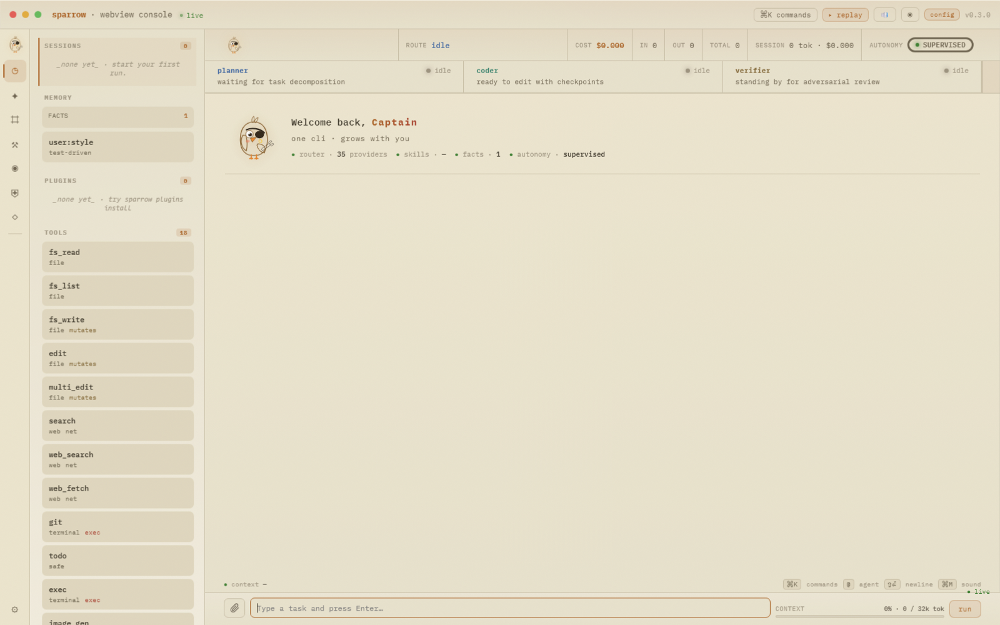
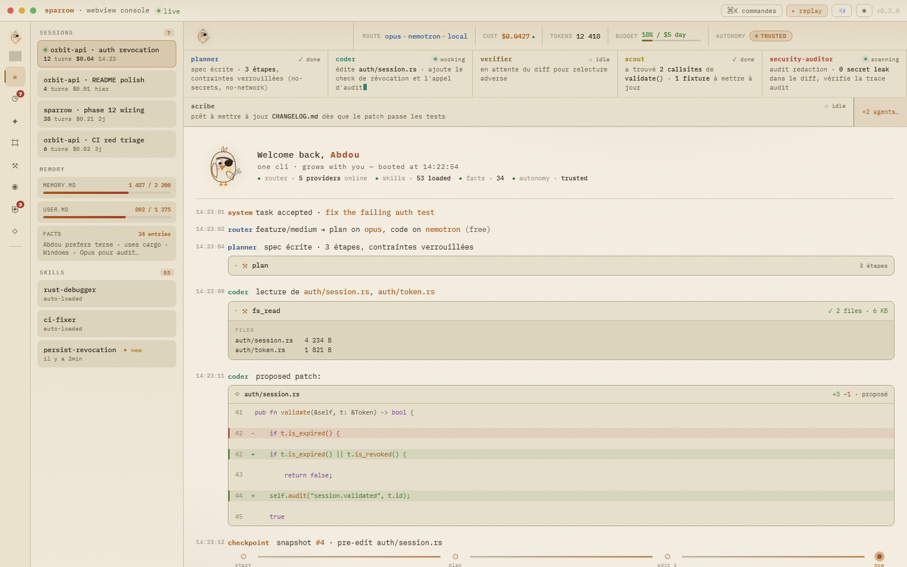

# Branding

Sparrow's visual identity is defined by:

## Palette

| Token | Hex | Role |
|---|---|---|
| `--bg` | `#0e0b08` | Near-black background |
| `--fg` | `#ece2cf` | Primary text |
| `--brand` | `#f2a93c` | Amber — brand, cost |
| `--coral` | `#f0674a` | Coral — secondary accent |
| `--agent` | `#4ec9b0` | Teal — active agent |
| `--planner` | `#6fa6e6` | Blue — planner |
| `--verifier` | `#c9a14e` | Sand — verifier |
| `--add` | `#74c258` | Green — diff + |
| `--rem` | `#d96a63` | Red — diff - |

## Typography

**IBM Plex Mono** everywhere. Weights 400/500/600/700.

Wordmark: 700 weight, letter-spacing ~3px, amber→coral gradient.

## Mascot

**Chubby pirate sparrow** — two-feather crest, thick dark eyebrow, open eye + pirate eye patch, downward coral beak, pink cheek blush, cream belly, key held in wing.

Full: `sparrow-mascot.svg` (240×240)
Cockpit: `sparrow-cockpit.svg` (28×28)
Console: `sparrow-ascii.txt`

## WebView Cockpit

The v0.3 cockpit keeps the presentation mockup's permanent rail, drawer stack,
swarm row, routed event stream, context meter, and multiline composer. The
shipping UI supports both Captain and Paper themes.

The reference used for the final polish pass is tracked locally for comparison:

## Voice

Concise, competent, a wink of pirate-builder character.
Never sycophantic, no emoji spam.
Rich personalities live in *agents* (SOUL files), not in base UI.

## Tagline

**"one cli · grows with you"**

## Persona

Pirate & builder. Small, fast, clever, and always holding the key.
